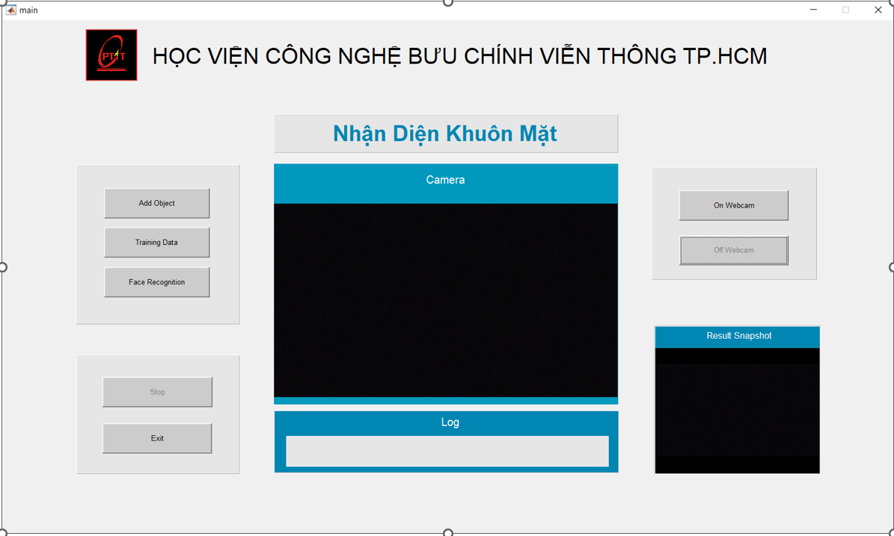
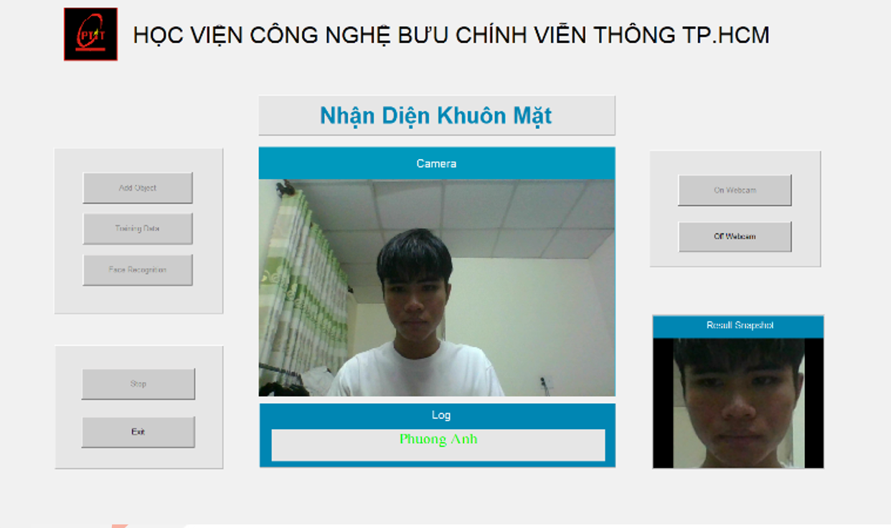
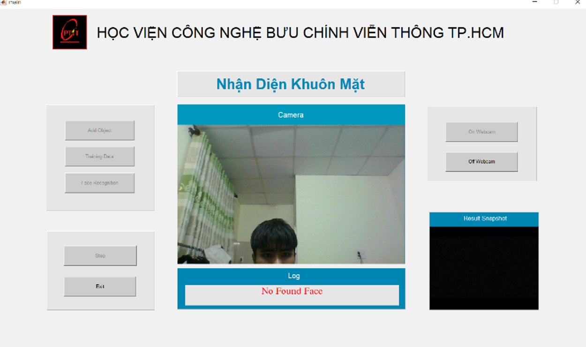

# APP FaceID
- Đồ án môn `Xử lý Ảnh` - Ứng dụng nhận diện khuân mặt trong Matlab 
- Sử dụng ngôn ngữ Matlab cùng thư viện Alexnet - một mạng nơ-ron trong bộ công cụ Deep Learning Toolbox có trong MATLAB. 

# Contributors
 - GVHD: `Nguyễn Hữu Phong`
 - AnhJun18 - `Lê Phương Anh`
 - vyhoang0708 - `Lê Hoàng Cẩm Vy`
 - MinhNhat165 - `Nguyễn Minh Nhật`

# Installation
  
  - Cài đặt Matlab 2019a: [Link](https://phanmem123.com/download-matlab-2019/)
  - Thêm thư viện MATLAB Support Package for USB Webcams: [Link](https://www.mathworks.com/matlabcentral/fileexchange/45182-matlab-support-package-for-usb-webcams?s_tid=srchtitle_webcam_2)
  - Thêm thư viện Deep Learning Toolbox Model for AlexNet Network: [Link](https://www.mathworks.com/matlabcentral/fileexchange/59133-deep-learning-toolbox-model-for-alexnet-network?s_tid=srchtitle_alexnet_2)

       
  - Clone source và mở bằng matlab
  - Chạy file `main.m`

# Introduction
 - Ấn `Add Object` để thêm đối tượng nhận dạng chương trình sẽ tiến hành mở webcam và chụp hình đối tượng.
 -  Ấn `Training Data` để tiến hành huấn luyện dữ liệu với dữ liệu ảnh đã thu thập.
 - Ấn `Face Recognition` để tiến hành nhận diện khuân mặt.
 
# Screenshot
 
 
 
